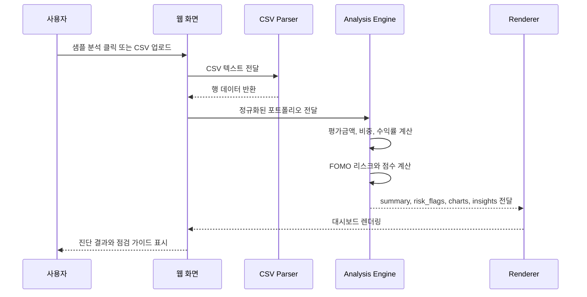

# FOMO Guard

> 포트폴리오가 최근 시장 분위기에 끌려 만들어진 것인지 점검하는 FOMO 리스크 진단 대시보드

FOMO Guard는 특정 종목을 추천하거나 매수, 매도 판단을 대신하는 서비스가 아닙니다. 사용자의 포트폴리오를 입력받아 최근 급등 자산 편입, 성과 추종, 섹터 쏠림 같은 행동 기반 리스크를 규칙 기반으로 진단하고, 사용자가 스스로 투자 이유를 점검할 수 있도록 돕는 해커톤 프로젝트입니다.

## 5초 요약

| 항목 | 내용 |
| --- | --- |
| 프로젝트 | FOMO Guard |
| 한 줄 정의 | 최근 시장 흐름이 내 포트폴리오 판단에 얼마나 반영되었는지 점검하는 웹 대시보드 |
| 핵심 문제 | 단순 수익률 화면은 사용자가 왜 특정 자산에 몰렸는지 설명하지 못함 |
| 해결 방식 | CSV 기반 포트폴리오를 분석해 후행 편입, 성과 추종, 섹터 쏠림 신호를 규칙 기반으로 진단 |
| 결과물 | Netlify 배포 웹앱, GitHub 저장소, 분석 규칙 PDF, 샘플 CSV |

## 바로 보기

- Live Demo: https://fomo-guard.netlify.app/
- GitHub: https://github.com/HCG0313/fomo-guard
- Website Source: `fomo-guard-site/`

## 목차

- [프로젝트가 해결하려는 문제](#프로젝트가-해결하려는-문제)
- [프로젝트가 의미하는 것](#프로젝트가-의미하는-것)
- [주요 기능](#주요-기능)
- [서비스 흐름](#서비스-흐름)
- [분석 처리 시퀀스](#분석-처리-시퀀스)
- [기술 선택과 이유](#기술-선택과-이유)
- [개발 과정과 시행착오](#개발-과정과-시행착오)
- [포트폴리오 문서 패키지](#포트폴리오-문서-패키지)
- [데이터 입력 형식](#데이터-입력-형식)
- [실행 방법](#실행-방법)
- [저장소 구조](#저장소-구조)
- [English Overview](#english-overview)

## 프로젝트가 해결하려는 문제

일반적인 투자 대시보드는 수익률, 평가금액, 자산 비중을 보여줍니다. 하지만 이런 숫자만으로는 사용자가 왜 특정 자산을 샀는지, 최근 시장 분위기에 영향을 받았는지, 특정 섹터가 포트폴리오를 과도하게 지배하고 있는지 설명하기 어렵습니다.

FOMO Guard는 다음 질문에서 출발했습니다.

- 최근 크게 오른 종목을 뒤늦게 편입한 것은 아닌가?
- 최근 성과가 좋았던 자산에만 비중이 커진 것은 아닌가?
- 반도체, AI, 기술주처럼 특정 강세 섹터가 전체 포트폴리오를 지배하고 있지는 않은가?
- 이 상태를 종목 추천 없이, 사용자가 스스로 점검할 수 있는 언어로 설명할 수 있을까?

그래서 이 프로젝트는 "무엇을 사야 하는가"가 아니라 "지금 내 포트폴리오가 어떤 흐름으로 만들어졌는가"를 보여주는 서비스로 설계했습니다.

## 프로젝트가 의미하는 것

FOMO Guard의 핵심 의미는 투자 판단을 대신하는 것이 아니라, 판단 직전에 한 번 멈춰서 스스로를 점검하게 만드는 것입니다.

많은 투자 서비스는 다음 질문에 답하려고 합니다.

> 지금 무엇을 사야 할까?

FOMO Guard는 다른 질문을 던집니다.

> 나는 왜 지금 이 자산을 사고 싶어졌을까?

이 차이가 프로젝트의 중심입니다. 사용자가 시장의 분위기, 단기 수익률, 주변의 관심에 끌려 판단하고 있는지 데이터로 확인하게 만드는 것이 이 프로젝트의 목적입니다.

## 주요 기능

- 샘플 포트폴리오 즉시 분석
- CSV 포트폴리오 업로드
- 시간 흐름 기반 FOMO 진단
- 종합 FOMO 점수 산출
- 국내/해외 자산 분리 분석
- 기준 포트폴리오 대비 섹터 편중 비교
- 투자 추천 없는 멘토형 점검 가이드

## 서비스 흐름

아래 다이어그램은 사용자가 웹사이트에서 데이터를 입력하고 진단 결과를 확인하는 전체 흐름입니다.


## 분석 처리 시퀀스

아래 시퀀스는 브라우저 안에서 CSV 입력부터 결과 렌더링까지 어떻게 처리되는지 보여줍니다. 이 프로젝트는 백엔드 서버 없이 정적 웹앱으로 동작합니다.



## 기술 선택과 이유

| 선택 | 이유 |
| --- | --- |
| 정적 HTML/CSS/JavaScript | 해커톤 심사자가 API 키나 서버 설정 없이 바로 실행할 수 있어야 했음 |
| CSV 업로드 | 개인 포트폴리오 데이터를 가장 단순하고 재현 가능하게 입력받기 위함 |
| Netlify 배포 | 빌드 과정 없이 정적 사이트를 빠르게 공개하기 위함 |
| 규칙 기반 분석 | 종목 추천처럼 보이지 않도록 판단 기준을 명시적으로 고정하기 위함 |
| Mermaid 문서화 | GitHub README에서 서비스 흐름과 처리 구조를 바로 보여주기 위함 |

## 개발 과정과 시행착오

| 단계 | 어려움 | 해결 |
| --- | --- | --- |
| 문제 정의 | 단순 수익률 화면만으로는 FOMO를 설명하기 어려웠음 | 수익률보다 "최근 편입", "성과 추종", "섹터 집중"을 중심으로 문제를 재정의 |
| 분석 규칙 | 같은 비중이라도 장기 보유와 후행 매수의 의미가 달랐음 | 매수일, 최근 7일/30일 수익률, 비중 변화율을 함께 보는 시간 흐름 기반 진단 설계 |
| 데이터 입력 | 사용자가 올리는 CSV의 컬럼이 부족할 수 있음 | `timeline_based`, `snapshot_estimated`, `insufficient_data` 상태값으로 진단 수준을 분리 |
| UX 문구 | FOMO 진단이 투자 조언처럼 보일 위험이 있었음 | 매수/매도 권유 표현을 제거하고 점검 가이드형 문장만 사용 |
| 제출 안정성 | 외부 금융 API를 쓰면 데모가 불안정해질 수 있었음 | 샘플 CSV와 클라이언트 분석 중심의 정적 웹앱으로 구현 |
| 최종 검증 | 규칙 문서와 실제 점수 산식이 일부 어긋날 수 있었음 | 최종 점검에서 FOMO 점수 항목과 인사이트 노출 개수를 규칙서 기준에 맞게 조정 |

## 포트폴리오 문서 패키지

취업 포트폴리오 관점에서 구현 결과뿐 아니라 의사결정 과정, 구조, 문제 해결, 회고, 면접 대응까지 확인할 수 있도록 `docs/` 폴더를 별도로 구성했습니다.

| 문서 | 목적 |
| --- | --- |
| [`docs/ARCHITECTURE.md`](./docs/ARCHITECTURE.md) | 서비스 구조, 데이터 흐름, 모듈 역할, 기술 선택 이유 |
| [`docs/TROUBLESHOOTING.md`](./docs/TROUBLESHOOTING.md) | 개발 중 겪은 문제와 해결 과정 |
| [`docs/RETROSPECTIVE.md`](./docs/RETROSPECTIVE.md) | 프로젝트 회고, 배운 점, 한계와 개선 방향 |
| [`docs/INTERVIEW.md`](./docs/INTERVIEW.md) | 30초 소개, 1분 소개, 예상 면접 질문과 답변 |

## 데이터 입력 형식

CSV 첫 줄은 헤더이며, 아래 필드를 기준으로 분석합니다.

| 필드 | 설명 | 구분 |
| --- | --- | --- |
| `asset_name` | 자산명 | 필수 |
| `asset_type` | 자산 유형 | 필수 |
| `sector` | 섹터 또는 산업 분류 | 필수 |
| `market` | 국내/해외 구분 | 권장 |
| `buy_price` | 평균 매수가 | 필수 |
| `current_price` | 현재가 | 필수 |
| `quantity` | 보유 수량 | 필수 |
| `purchase_date` | 매수일 | 정밀 진단 |
| `recent_7d_return` | 최근 7일 수익률 | 정밀 진단 |
| `recent_30d_return` | 최근 30일 수익률 | 정밀 진단 |
| `recent_30d_volatility` | 최근 30일 변동성 | 정밀 진단 |
| `weight_change_7d` | 최근 7일 비중 변화율 | 권장 |
| `weight_change_30d` | 최근 30일 비중 변화율 | 권장 |

예시:

```csv
asset_name,asset_type,sector,market,buy_price,current_price,quantity,purchase_date,recent_7d_return,recent_30d_return,recent_30d_volatility,weight_change_7d,weight_change_30d
SK하이닉스,Stock,Semiconductor,KR,186000,224000,8,2026-04-25,13.4,22.1,17.4,5.1,7.6
QQQ,ETF,Technology,US,430,446,5,2026-03-12,3.1,7.2,6.4,0.8,1.4
```

## 실행 방법

이 프로젝트는 정적 웹앱입니다. 별도 빌드 없이 실행할 수 있습니다.

### 방법 1. 브라우저에서 직접 열기

1. `fomo-guard-site/index.html`을 브라우저에서 엽니다.
2. `대표 샘플 분석` 버튼을 누릅니다.
3. 또는 `sample_portfolio.csv` 형식에 맞춘 CSV를 업로드합니다.

### 방법 2. 로컬 서버 실행

```bash
cd fomo-guard-site
node serve-site.js
```

브라우저에서 다음 주소를 엽니다.

```text
http://127.0.0.1:8093/
```

## 저장소 구조

```text
fomo-guard/
  fomo-guard-site/
    index.html
    styles.css
    app.js
    sample_portfolio.csv
    serve-site.js
    serve-site.ps1
  docs/
    README.md
    ARCHITECTURE.md
    TROUBLESHOOTING.md
    RETROSPECTIVE.md
    INTERVIEW.md
  README.md
  FOMO Guard.pdf
  FOMO Guard Skills.pdf
  01_Portfolio_Analysis_Rules.pdf
  02_Dashboard_Visualization_Rules.pdf
  03_Insight_Guardrail_Rules.pdf
  04_Input_Data_and_Sample_Spec.pdf
  05_Web_App_Flow_and_Output_Schema.pdf
```

## 문서

- `FOMO Guard.pdf`
- `FOMO Guard Skills.pdf`
- `01_Portfolio_Analysis_Rules.pdf`
- `02_Dashboard_Visualization_Rules.pdf`
- `03_Insight_Guardrail_Rules.pdf`
- `04_Input_Data_and_Sample_Spec.pdf`
- `05_Web_App_Flow_and_Output_Schema.pdf`

## 제출 전 체크리스트

- [x] Live Demo 링크 제공
- [x] GitHub 저장소 공개
- [x] 샘플 CSV 포함
- [x] README에 문제 정의, 기능, 실행 방법, 데이터 구조 포함
- [x] Mermaid flowchart와 sequence diagram 추가
- [x] 종목 추천이 아니라 점검 서비스임을 명시

---

# English Overview

> A portfolio dashboard that checks whether investment decisions were shaped by recent market hype and FOMO-driven behavior.

FOMO Guard is not a stock recommendation service. It does not tell users what to buy, sell, or hold. Instead, it analyzes a user's portfolio and helps them understand whether recent price movements, performance chasing, or sector concentration may have influenced their decisions.

## Problem

Most portfolio dashboards show numbers such as return, value, allocation, and profit or loss. Those numbers are useful, but they do not explain how the portfolio was formed.

FOMO Guard focuses on a different question:

- Did the user enter recently rising assets too late?
- Did high-performing assets become too large in the portfolio?
- Is one hot sector dominating the whole portfolio?
- Can these risks be explained without giving investment advice?

## Solution

The project analyzes portfolio CSV data in the browser and generates a rule-based FOMO diagnosis. It separates the diagnosis into three states:

- `timeline_based`: enough time-related data exists for detailed diagnosis
- `snapshot_estimated`: time data is missing, so the system estimates from current portfolio structure
- `insufficient_data`: required fields are missing and analysis cannot continue

## Key Features

- Instant sample portfolio analysis
- CSV portfolio upload
- Timeline-based FOMO diagnosis
- Overall FOMO score
- Domestic and overseas asset separation
- Sector concentration comparison against a benchmark portfolio
- Mentor-style guidance without investment recommendations

## What This Project Means

FOMO Guard is a pause button for investment behavior. Many tools try to answer, "What should I buy?" This project asks, "Why do I want to buy it now?"

That is the core meaning of the project: helping users recognize whether recent market excitement has quietly shaped their portfolio.

## Important Note

FOMO Guard does not provide financial advice. All outputs are limited to portfolio review, concentration analysis, behavioral interpretation, and self-check guidance.
