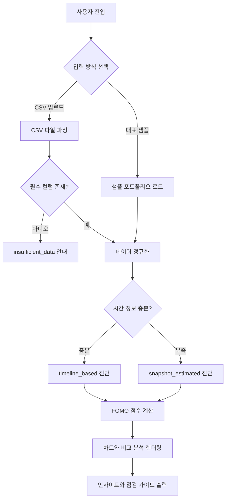
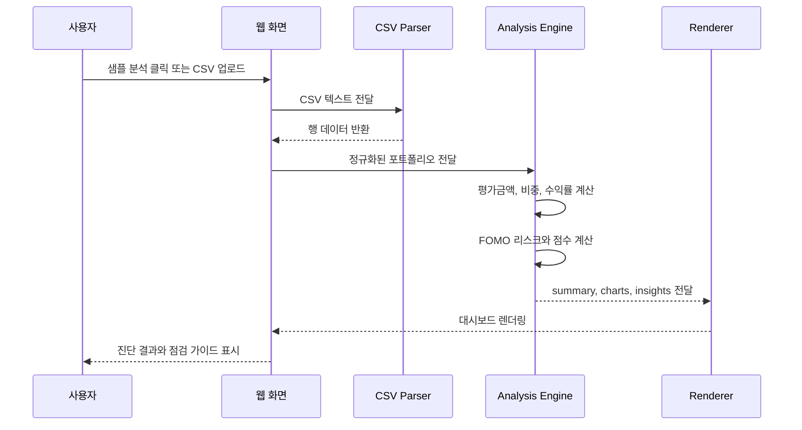

# FOMO Guard

> 최근 시장 분위기와 단기 성과 추종이 내 포트폴리오에 얼마나 반영되었는지 점검하는 FOMO 리스크 진단 대시보드

FOMO Guard는 종목 추천 서비스가 아닙니다. 사용자의 포트폴리오 CSV를 분석해 최근 급등 자산 편입, 성과 추종, 섹터 쏠림 같은 행동 기반 리스크를 보여주고, 사용자가 스스로 투자 이유를 점검하도록 돕는 웹앱입니다.

## 5초 요약

| 항목 | 내용 |
| --- | --- |
| 문제 | 단순 수익률 화면은 사용자가 왜 특정 자산에 몰렸는지 설명하지 못함 |
| 해결 | 매수일, 최근 수익률, 비중 변화, 섹터 집중도를 함께 분석해 FOMO 신호를 진단 |
| 결과 | Netlify에서 바로 실행 가능한 정적 웹앱과 GitHub 포트폴리오 문서 구성 |
| 역할 | 문제 정의, 분석 규칙 설계, CSV 입력 구조, 웹앱 UI/로직, README/문서화 |
| 링크 | [Live Demo](https://fomo-guard.netlify.app/) / [GitHub](https://github.com/HCG0313/fomo-guard) |

## 목차

- [프로젝트가 해결하려는 문제](#프로젝트가-해결하려는-문제)
- [프로젝트의 의미](#프로젝트의-의미)
- [주요 기능](#주요-기능)
- [서비스 흐름](#서비스-흐름)
- [분석 처리 시퀀스](#분석-처리-시퀀스)
- [기술 선택과 이유](#기술-선택과-이유)
- [개발 과정과 시행착오](#개발-과정과-시행착오)
- [포트폴리오 문서](#포트폴리오-문서)
- [실행 방법](#실행-방법)
- [English Overview](#english-overview)

## 프로젝트가 해결하려는 문제

일반적인 투자 대시보드는 수익률, 평가금액, 자산 비중을 보여줍니다. 하지만 그 숫자만으로는 사용자가 최근 시장 분위기에 휩쓸렸는지, 특정 섹터에 과도하게 몰렸는지, 최근 급등한 자산을 뒤늦게 편입했는지 설명하기 어렵습니다.

이 프로젝트는 다음 질문에서 출발했습니다.

- 최근 크게 오른 자산을 뒤늦게 편입했는가?
- 최근 성과가 좋은 자산 중심으로 비중이 커졌는가?
- 특정 강세 섹터가 전체 포트폴리오를 지배하고 있는가?
- 투자 추천 없이 이 상태를 점검형 언어로 설명할 수 있는가?

## 프로젝트의 의미

FOMO Guard는 "무엇을 사야 하는가"가 아니라 "왜 지금 사고 싶어졌는가"를 묻는 서비스입니다.

투자 판단을 대신하지 않고, 사용자가 자신의 포트폴리오가 어떤 흐름으로 만들어졌는지 되돌아보게 만드는 것이 핵심 의미입니다.

## 주요 기능

- 샘플 포트폴리오 즉시 분석
- CSV 포트폴리오 업로드
- 시간 흐름 기반 FOMO 진단
- 종합 FOMO 점수 산출
- 국내/해외 자산 분리 분석
- 기준 포트폴리오 대비 섹터 편중 비교
- 투자 추천 없는 멘토형 점검 가이드

## 서비스 흐름

Mermaid 가이드 기준에 맞춰, 전체 서비스 흐름은 flowchart로 정리했습니다.



## 분석 처리 시퀀스

사용자, 화면, CSV 파서, 분석 엔진, 렌더러 사이의 상호작용은 sequence diagram으로 정리했습니다.



## 기술 선택과 이유

| 선택 | 이유 |
| --- | --- |
| 정적 HTML/CSS/JavaScript | 심사자와 사용자가 별도 설치나 API 키 없이 바로 실행 가능 |
| CSV 업로드 | 개인 포트폴리오 데이터를 가장 단순하고 재현 가능하게 입력 가능 |
| Netlify 배포 | 정적 웹앱을 빠르게 공개하고 데모 링크 제공 가능 |
| 규칙 기반 분석 | 투자 추천처럼 보이지 않도록 판단 기준을 명시적으로 고정 |
| Mermaid 문서화 | GitHub README에서 흐름과 상호작용을 바로 시각화 |

## 개발 과정과 시행착오

| 단계 | 어려움 | 해결 |
| --- | --- | --- |
| 문제 정의 | 수익률만으로는 FOMO를 설명하기 어려웠음 | 최근 편입, 성과 추종, 섹터 집중을 핵심 질문으로 재정의 |
| 분석 규칙 | 같은 비중이라도 장기 보유와 후행 매수의 의미가 달랐음 | 매수일, 최근 수익률, 비중 변화율을 함께 보는 시간 흐름 기반 진단 설계 |
| 데이터 입력 | CSV에 시간 정보가 부족할 수 있었음 | `timeline_based`, `snapshot_estimated`, `insufficient_data` 상태값으로 진단 수준 분리 |
| UX 문구 | 진단 결과가 투자 조언처럼 보일 위험이 있었음 | 매수/매도 표현 제거, 점검형 가이드 문장만 사용 |
| 제출 안정성 | 외부 API 사용 시 인증/네트워크 문제가 생길 수 있었음 | 샘플 CSV와 클라이언트 분석 중심의 정적 웹앱으로 구현 |
| 최종 검증 | 규칙 문서와 실제 점수 산식이 어긋날 수 있었음 | FOMO 점수 항목과 인사이트 개수를 규칙서 기준으로 재확인 |

## 포트폴리오 문서

GitHub 취업 포트폴리오 가이드 기준에 맞춰, 구현 결과뿐 아니라 의사결정과 문제 해결 과정을 `docs/`에 분리했습니다.

| 문서 | 목적 |
| --- | --- |
| [`docs/ARCHITECTURE.md`](./docs/ARCHITECTURE.md) | 서비스 구조, 데이터 흐름, 분석 모듈 역할 |
| [`docs/TROUBLESHOOTING.md`](./docs/TROUBLESHOOTING.md) | 개발 중 겪은 문제와 해결 과정 |
| [`docs/RETROSPECTIVE.md`](./docs/RETROSPECTIVE.md) | 회고, 배운 점, 한계와 개선 방향 |
| [`docs/INTERVIEW.md`](./docs/INTERVIEW.md) | 30초 소개, 1분 소개, 예상 면접 질문 |

## 데이터 입력 형식

CSV 첫 줄은 헤더이며, 아래 필드를 기준으로 분석합니다.

| 필드 | 설명 | 구분 |
| --- | --- | --- |
| `asset_name` | 자산명 | 필수 |
| `asset_type` | 자산 유형 | 필수 |
| `sector` | 섹터 또는 산업 분류 | 필수 |
| `market` | 국내/해외 구분 | 권장 |
| `buy_price` | 평균 매수가 | 필수 |
| `current_price` | 현재가 | 필수 |
| `quantity` | 보유 수량 | 필수 |
| `purchase_date` | 매수일 | 정밀 진단 |
| `recent_7d_return` | 최근 7일 수익률 | 정밀 진단 |
| `recent_30d_return` | 최근 30일 수익률 | 정밀 진단 |
| `recent_30d_volatility` | 최근 30일 변동성 | 정밀 진단 |
| `weight_change_7d` | 최근 7일 비중 변화율 | 권장 |
| `weight_change_30d` | 최근 30일 비중 변화율 | 권장 |

## 실행 방법

### 방법 1. 브라우저에서 직접 열기

1. `fomo-guard-site/index.html`을 브라우저에서 엽니다.
2. `대표 샘플 분석` 버튼을 누릅니다.
3. 또는 `sample_portfolio.csv` 형식에 맞춘 CSV를 업로드합니다.

### 방법 2. 로컬 서버 실행

```bash
cd fomo-guard-site
node serve-site.js
```

```text
http://127.0.0.1:8093/
```

## 저장소 구조

```text
fomo-guard/
  fomo-guard-site/
    index.html
    styles.css
    app.js
    sample_portfolio.csv
    serve-site.js
    serve-site.ps1
  docs/
    README.md
    ARCHITECTURE.md
    TROUBLESHOOTING.md
    RETROSPECTIVE.md
    INTERVIEW.md
  README.md
  FOMO Guard.pdf
  FOMO Guard Skills.pdf
  01_Portfolio_Analysis_Rules.pdf
  02_Dashboard_Visualization_Rules.pdf
  03_Insight_Guardrail_Rules.pdf
  04_Input_Data_and_Sample_Spec.pdf
  05_Web_App_Flow_and_Output_Schema.pdf
```

## 제출 전 체크리스트

- [x] Live Demo 링크 제공
- [x] GitHub 저장소 공개
- [x] 샘플 CSV 포함
- [x] README에 문제 정의, 실행 방법, 데이터 구조 포함
- [x] Mermaid flowchart와 sequence diagram 추가
- [x] 트러블슈팅/회고/면접 문서 분리
- [x] 종목 추천이 아니라 점검 서비스임을 명시

---

# English Overview

> A portfolio dashboard that checks whether investment decisions were shaped by recent market hype and FOMO-driven behavior.

FOMO Guard is not a stock recommendation service. It does not tell users what to buy, sell, or hold. Instead, it analyzes a user's portfolio and helps them understand whether recent price movements, performance chasing, or sector concentration may have influenced their decisions.

## Problem

Most portfolio dashboards show return, value, allocation, and profit or loss. Those numbers are useful, but they do not explain how the portfolio was formed.

FOMO Guard focuses on a different question: did recent market excitement quietly shape this portfolio?

## Solution

The project analyzes portfolio CSV data in the browser and generates a rule-based FOMO diagnosis. It separates results into `timeline_based`, `snapshot_estimated`, and `insufficient_data` states so that the system does not overstate conclusions when data is missing.

## Meaning

FOMO Guard is a pause button for investment behavior. Many tools ask, "What should I buy?" This project asks, "Why do I want to buy it now?"

## Important Note

FOMO Guard does not provide financial advice. All outputs are limited to portfolio review, concentration analysis, behavioral interpretation, and self-check guidance.
