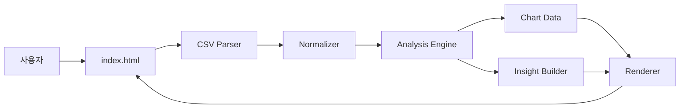
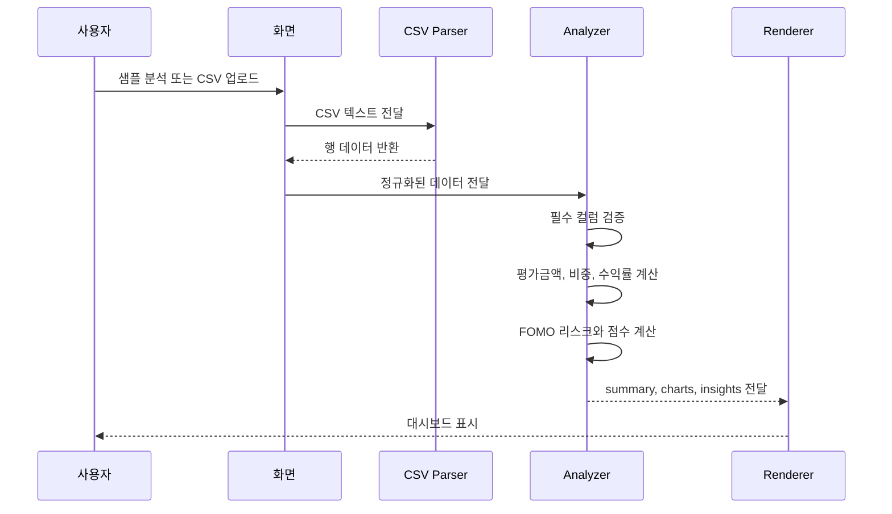

# Architecture

FOMO Guard는 브라우저 안에서 CSV 입력, 데이터 정규화, FOMO 분석, 차트 렌더링까지 처리하는 정적 웹앱입니다.

## 전체 구조

## 파일별 역할

| 파일 | 역할 |
| --- | --- |
| `index.html` | 화면 구조, 업로드 입력, 대시보드 영역 |
| `styles.css` | 레이아웃, 반응형 스타일, 차트 UI |
| `app.js` | CSV 파싱, 데이터 정규화, FOMO 점수 계산, DOM 렌더링 |
| `sample_portfolio.csv` | 대표 분석 시나리오와 업로드 테스트 데이터 |
| `serve-site.js` | 로컬 테스트용 정적 서버 |

## 분석 시퀀스

## 진단 상태

| 상태 | 조건 | 의미 |
| --- | --- | --- |
| `timeline_based` | 시간 정보가 충분함 | 시간 흐름 기반 정밀 진단 |
| `snapshot_estimated` | 기본 분석은 가능하지만 시간 정보 부족 | 현재 구조 기반 추정 진단 |
| `insufficient_data` | 기본 필수 컬럼 부족 | 분석 불가 안내 |

## 기술 선택 이유

| 선택 | 이유 |
| --- | --- |
| 정적 웹앱 | 배포와 실행 안정성 확보 |
| CSV 입력 | 별도 계정/API 없이 사용자 데이터 입력 가능 |
| 규칙 기반 분석 | 투자 추천처럼 보이지 않도록 판단 기준 고정 |
| Netlify | 데모 URL을 빠르게 공유 가능 |

