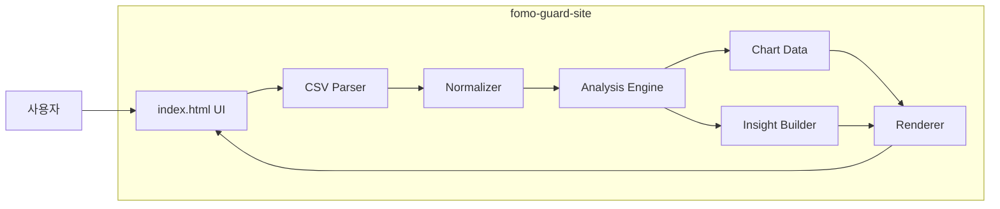
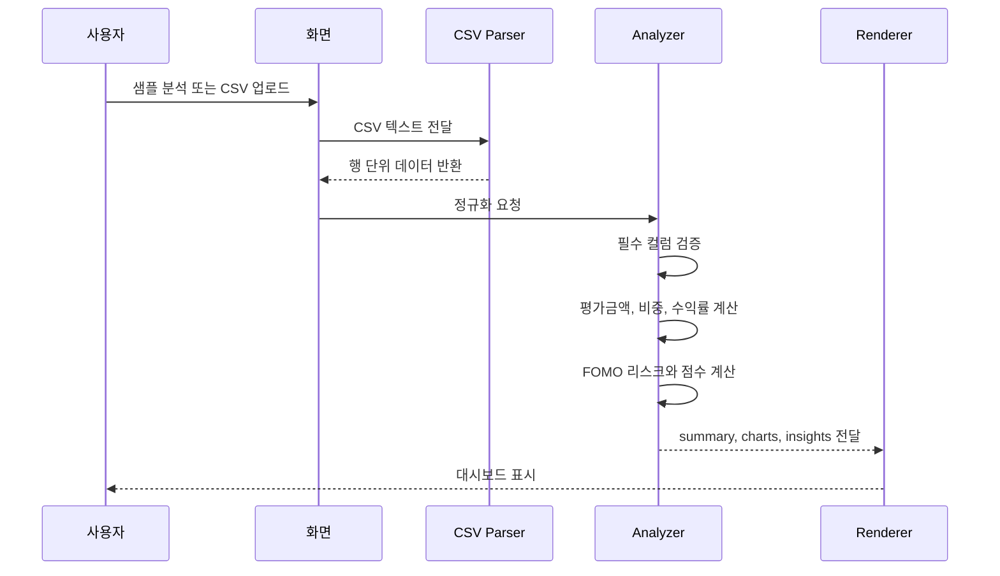

# Architecture

FOMO Guard는 별도 백엔드 없이 브라우저 안에서 CSV 입력, 데이터 정규화, FOMO 분석, 차트 렌더링까지 처리하는 정적 웹앱입니다.

## 설계 목표

| 목표 | 설명 |
| --- | --- |
| 즉시 실행 | API 키, 로그인, 서버 설정 없이 데모 URL에서 바로 확인 |
| 재현 가능성 | 샘플 CSV와 입력 스키마를 공개해 같은 결과를 재현 가능 |
| 설명 가능성 | FOMO 점수와 인사이트가 규칙 문서에 근거하도록 설계 |
| 비추천 원칙 | 매수, 매도, 보유 권유 없이 점검형 문장만 제공 |

## 전체 구조

## 파일별 역할

| 파일 | 역할 |
| --- | --- |
| `index.html` | 화면 구조, 업로드 입력, 대시보드 영역 |
| `styles.css` | 반응형 레이아웃, 카드 UI, 차트 스타일 |
| `app.js` | CSV 파싱, 데이터 정규화, 리스크 계산, 인사이트 생성, DOM 렌더링 |
| `sample_portfolio.csv` | 대표 분석 시나리오와 업로드 테스트 데이터 |
| `serve-site.js` | 로컬 테스트용 정적 서버 |

## 분석 데이터 흐름

## 핵심 진단 상태

| 상태 | 조건 | 화면 의미 |
| --- | --- | --- |
| `timeline_based` | 매수일, 최근 수익률, 변동성 등 시간 정보가 충분함 | 시간 흐름 기반 정밀 진단 |
| `snapshot_estimated` | 기본 분석은 가능하지만 시간 정보가 부족함 | 현재 상태 기반 추정 진단 |
| `insufficient_data` | 기본 필수 컬럼 부족 | 분석 불가 안내 |

## FOMO 점수 구성

| 항목 | 판단 이유 |
| --- | --- |
| 후행 편입 | 최근 급등 후 뒤늦게 편입했는지 확인 |
| 성과 추종 | 최근 성과 상위 자산에 비중이 쏠렸는지 확인 |
| 후행 섹터 집중 | 최근 강세 섹터에 후행적으로 집중되었는지 확인 |
| 단일 자산 집중 | 특정 자산이 포트폴리오를 지배하는지 확인 |
| 섹터 편중 | 기준 포트폴리오 대비 특정 섹터 비중이 과도한지 확인 |

## 주요 기술 선택

| 선택 | 대안 | 선택 이유 |
| --- | --- | --- |
| 정적 웹앱 | 백엔드 서버 | 제출 환경에서 안정적으로 실행하기 위해 서버 의존성 제거 |
| CSV 업로드 | 증권사 API | 인증, 개인정보, API 키 문제 없이 사용자 데이터 입력 가능 |
| 규칙 기반 진단 | AI 임의 해석 | 투자 조언처럼 보이지 않도록 판단 기준을 명시적으로 고정 |
| Netlify 배포 | 로컬 실행만 제공 | 심사자와 리뷰어가 URL만으로 바로 확인 가능 |

## 한계

- 실시간 시세 API를 사용하지 않기 때문에 현재가는 입력 데이터에 의존합니다.
- FOMO 점수는 행동 리스크 점검 지표이며 투자 성과 예측 지표가 아닙니다.
- 샘플 데이터는 서비스 기능을 보여주기 위한 예시이며 실제 투자 판단 근거가 아닙니다.

