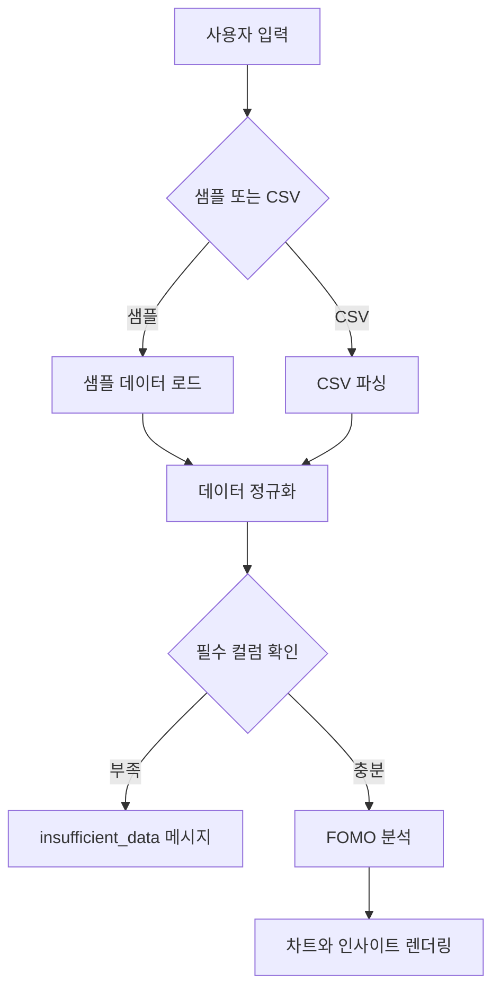

# FOMO Guard Web MVP

`fomo-guard-site/`는 FOMO Guard의 정적 웹앱 소스 폴더입니다. 별도 빌드, 서버, API 키 없이 브라우저에서 바로 실행할 수 있도록 구성했습니다.

## 목적

- 샘플 포트폴리오로 즉시 기능 확인
- CSV 업로드를 통한 사용자 포트폴리오 분석
- 시간 흐름 기반 FOMO 진단 우선 노출
- 국내/해외 자산 분리 분석
- 종목 추천 없는 점검형 인사이트 제공

## 파일 구성

| 파일 | 역할 |
| --- | --- |
| `index.html` | 메인 화면과 대시보드 마크업 |
| `styles.css` | 화면 레이아웃, 반응형 스타일, 차트 UI |
| `app.js` | CSV 파서, 분석 로직, FOMO 점수 계산, 렌더링 로직 |
| `sample_portfolio.csv` | 샘플 분석 및 업로드 테스트용 데이터 |
| `serve-site.js` | 로컬 정적 서버 |
| `serve-site.ps1` | PowerShell 실행 보조 스크립트 |

## 로컬 실행

### 방법 1. 파일 직접 열기

1. `index.html`을 브라우저에서 엽니다.
2. `대표 샘플 분석` 버튼을 누릅니다.
3. 또는 `sample_portfolio.csv` 형식에 맞춘 CSV를 업로드합니다.

### 방법 2. 로컬 서버 사용

```bash
node serve-site.js
```

브라우저에서 다음 주소를 엽니다.

```text
http://127.0.0.1:8093/
```

## 입력 데이터 규칙

| 컬럼 | 설명 | 구분 |
| --- | --- | --- |
| `asset_name` | 자산명 | 필수 |
| `asset_type` | 자산 유형 | 필수 |
| `sector` | 섹터 분류 | 필수 |
| `market` | 국내/해외 구분 | 권장 |
| `buy_price` | 평균 매수가 | 필수 |
| `current_price` | 현재가 | 필수 |
| `quantity` | 보유 수량 | 필수 |
| `purchase_date` | 매수일 | 정밀 진단 |
| `recent_7d_return` | 최근 7일 수익률 | 정밀 진단 |
| `recent_30d_return` | 최근 30일 수익률 | 정밀 진단 |
| `recent_30d_volatility` | 최근 30일 변동성 | 정밀 진단 |
| `weight_change_7d` | 최근 7일 비중 변화율 | 권장 |
| `weight_change_30d` | 최근 30일 비중 변화율 | 권장 |

## 웹앱 처리 흐름



## 진단 상태값

| 상태값 | 의미 |
| --- | --- |
| `timeline_based` | 매수일과 최근 수익률 정보가 충분해 시간 흐름 기반 정밀 진단 가능 |
| `snapshot_estimated` | 시간 정보가 부족해 현재 포트폴리오 구조 기반으로 추정 |
| `insufficient_data` | 기본 필수 컬럼이 부족해 분석 불가 |

## 배포

정적 호스팅 서비스에 `fomo-guard-site/` 폴더를 배포하면 됩니다.

- Netlify
- Vercel
- GitHub Pages
- Cloudflare Pages

현재 데모:

```text
https://fomo-guard.netlify.app/
```

## 점검 체크리스트

- [x] 대표 샘플 분석 가능
- [x] CSV 업로드 가능
- [x] 시간 정보 기반 진단과 추정 진단 구분
- [x] FOMO 진단이 일반 수익률보다 먼저 노출
- [x] 종목 추천 없이 점검 가이드 중심으로 출력
